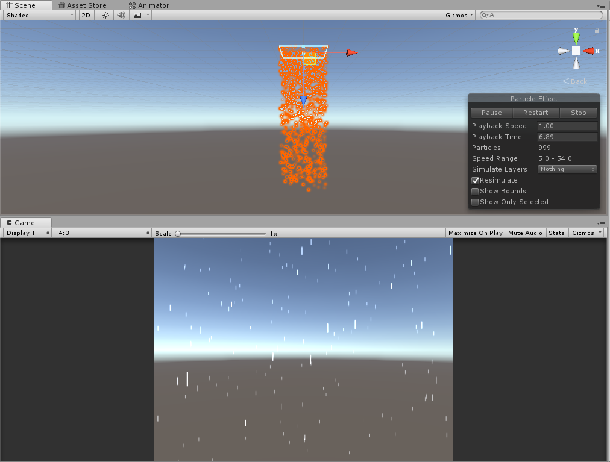

# Particle System Collection

## Overview

A place to show the particle system collection. Fell free to use it :)

## Features:

### Action Particle

* Fire Particle

* Explosion

### Environment Particle

* Ground Pound Particle

* Snow Falling Particle

* Rain Falling Particle

* Leaves Falling Particle

